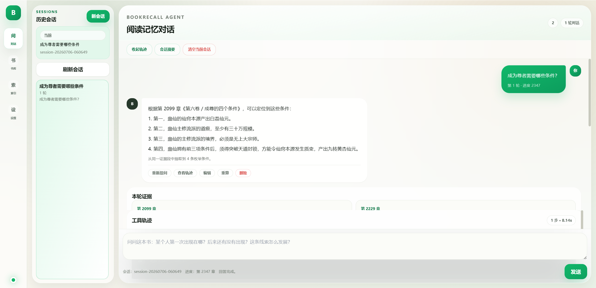

# BookRecall

BookRecall 是一个面向长篇阅读场景的本地阅读记忆 Agent。它的目标不是“替你读书”，而是在你读完很久以后，帮你快速找回人物、道具、事件、主题和原文证据。

它特别适合这类问题：

- “某个人物第一次出现在哪一章？”
- “这个道具后来还有出现过吗？”
- “第 50 章那个黑衣人后来是谁？”
- “成为尊者条件是什么？”
- “这本书里关于自由意志的观点前后有什么变化？”

BookRecall 和普通 RAG 的区别在于：它不是只靠向量检索，而是把章节解析、结构化索引、向量召回、重排模型、阅读进度保护和 Agent 工具规划组合在一起，尽量做到“定位准确、有原文证据、不过度剧透”。



## 文档导航

- [快速开始](#快速开始)：在 Windows 上安装、启动并打开 Web。
- [模型配置](#模型选择)：配置 Embedding、Reranker 和本地对话模型。
- [Web 使用流程](#web-使用流程)：导入 TXT、构建索引并开始多轮问答。
- [CLI 使用](#cli-使用)：通过命令行构建、诊断和测试召回。
- [工作原理](#two-phase-indexing)：了解 Two-Phase Indexing 与结构化写回。
- [性能与排障](#性能建议)：处理首次加载慢、索引慢和召回偏题。
- [开发状态](AGENT_STATUS.md)：查看已完成能力、技术债与路线图。

本文档面向安装和使用。研发完成度、已知质量风险和后续优先级统一记录在 [AGENT_STATUS.md](AGENT_STATUS.md)，召回数据格式与指标定义见 [eval/README.md](eval/README.md)。

## 当前状态

BookRecall 目前是一个可运行的本地 Agent MVP，已经具备：

- 本地 SQLite 书库和索引。
- 中文长篇 TXT 章节解析，支持“卷 / 节 / 章”结构。
- Parent / Child 分层切块。
- 实体、关系、主题、事件、章节摘要等结构化索引。
- 阅读进度保护，工具调用和最终证据都会被限制在已读范围内。
- CLI 命令行工具。
- Vue 3 + Vite + TypeScript Web 控制台。
- TXT 文件导入，不在页面预览全文，避免大文件卡住前端。
- Two-Phase Indexing：导入阶段优先构建基础索引和向量索引，复杂结构化理解按需调用本地 LLM。
- Qwen3 Embedding + Qwen3 Reranker 本地召回链路。
- 本地 Qwen / LM Studio / OpenAI-compatible endpoint 接入入口。
- 多轮对话、会话历史、历史轮次编辑、工具调用轨迹展示。

当前成熟度：

| 能力 | 状态 | 说明 |
| --- | --- | --- |
| TXT 导入与章节解析 | 可用 | 已覆盖常见“卷 / 节 / 章”结构 |
| 本地混合召回 | 可用 | 倒排 + Qwen3 Embedding + Qwen3 Reranker |
| 证据式多轮问答 | 可用 | 支持工具轨迹、原文定位与阅读进度限制 |
| 动态结构化写回 | 部分完成 | 已有质量门、审计与逐条人工治理；旧未追踪数据仍需迁移 |
| 召回与 Agent 评测 | 部分完成 | 已有 CLI、指标和 3 条真实回归案例，仍需扩充数据集 |
| LangGraph 工作流 | 实验性 | 可选策略，尚无完整 checkpoint / interrupt |
| 多格式与跨书检索 | 未完成 | 当前重点支持单书 TXT |

更细的工程状态请看 [AGENT_STATUS.md](AGENT_STATUS.md)。

## 推荐架构

当前推荐链路是：

```text
User Query
   |
   v
BookRecall Agent
   |
   |- Query Understanding / Planner
   |  `- 本地 Qwen3.5-4B 或 OpenAI-compatible API
   |
   |- Tools
   |  |- lookup_first_appearance
   |  |- lookup_timeline
   |  |- lookup_relations
   |  |- search_theme
   |  |- search_events
   |  |- search_evidence
   |  |- search_exact_text
   |  |- lookup_entity_aliases
   |  |- get_chapter_summary
   |  `- list_entities
   |
   |- Retrieval
   |  |- LocalRetriever：倒排检索，稳定兜底
   |  |- EmbeddingRetriever：Qwen3-Embedding-0.6B 粗召回
   |  `- CrossEncoderReranker：Qwen3-Reranker-0.6B 精排
   |
   |- Validation
   |  |- 条件类问题的确定性枚举抽取
   |  |- 死亡 / 结局等高风险事实核验
   |  `- 阅读进度与证据边界复核
   |
   `- MemoryCard
      |- 回答
      |- 章节定位
      |- 原文证据
      |- 工具 trace
      `- 防剧透状态
```

本地数据层：

```text
D:\BookRecall
   |- .bookrecall/
   |  |- bookrecall.db        SQLite 数据库
   |  `- vectors/             FAISS / numpy 向量索引
   |
   |- .cache/
   |  |- huggingface/         Hugging Face / sentence-transformers 缓存
   |  `- torch/               torch 缓存
   |
   |- models/
   |  |- Qwen3-Embedding-0.6B
   |  |- Qwen3-Reranker-0.6B
   |  `- llm/
   |
   |- frontend/               Vue 前端源码
   |- src/bookrecall/         Python 后端和 Agent
   |- tests/                  单元测试
   |- start_bookrecall.ps1    Windows 一键启动脚本
   `- bookrecall.py           CLI 入口
```

`models/`、`.cache/`、`.bookrecall/` 都不会进入 Git。

## 模型选择

当前默认推荐：

| 用途                        | 推荐模型                         | 说明                                                           |
| --------------------------- | -------------------------------- | -------------------------------------------------------------- |
| Embedding 粗召回            | `Qwen/Qwen3-Embedding-0.6B`    | 替代旧的`BAAI/bge-small-zh-v1.5`，语义召回更强               |
| Reranker 精排               | `Qwen/Qwen3-Reranker-0.6B`     | 对候选证据重新排序，提高命中准确率                             |
| 本地 Agent / 按需结构化理解 | 本地 Qwen3.5-4B 或 Qwen3-4B GGUF | 可通过 LM Studio / llama.cpp / OpenAI-compatible endpoint 接入 |

注意：

- 当前 embedding / reranker 代码使用 `sentence-transformers`，需要 Hugging Face 原版模型目录，不是 GGUF 单文件。
- GGUF 更适合本地对话 LLM，不适合直接填到 embedding / reranker 字段。
- 旧 BGE 向量索引不会自动变成 Qwen 索引。切换 Qwen embedding 后，需要重建向量索引。

## 环境要求

最低要求：

- Python `>=3.11`
- Windows / macOS / Linux 均可，当前项目主要在 Windows 路径下验证
- 基础 CLI 和基础 Web 可只使用 Python 标准库

推荐本地模型配置：

- NVIDIA GPU：RTX 3060 Laptop 6GB 或更高
- CPU：Intel 12700H 级别或更高
- 内存：16GB 起步，32GB 更舒服
- 磁盘：建议预留 10GB 以上

前端开发需要：

- Node.js `18+`（推荐当前 LTS）
- npm `9+`

### 依赖分组

Python 基础包本身不强制安装第三方依赖；本地模型能力通过 `pyproject.toml` 中的可选分组启用：

| 分组 | 主要依赖 | 用途 | 是否推荐 |
| --- | --- | --- | --- |
| 基础 `-e .` | 无额外运行时依赖 | TXT、SQLite、倒排检索、CLI、基础 Web | 必需 |
| `embedding` | `numpy`、`sentence-transformers` | Qwen3 Embedding 与 Reranker | 推荐 |
| `faiss` | `faiss-cpu` | 大书向量近邻检索 | 推荐 |
| `graph` | `langgraph` | 可选 LangGraph 策略 | 可选 |
| `local-llm` | `llama-cpp-python` | Web 进程内直接加载 GGUF | 可选 |
| `full` | 上述依赖及实验性历史依赖 | 全功能开发环境 | 不建议首次安装 |

主路径推荐使用 `embedding,faiss,graph`。如果本地对话模型由 LM Studio 或 llama.cpp server 提供 OpenAI-compatible endpoint，就不需要安装 `local-llm`。

## 快速开始

以下命令使用项目内虚拟环境。一键启动脚本会在相关环境变量未被预先设置时，把 Hugging Face、sentence-transformers 和 torch 缓存指向 `D:\BookRecall\.cache`。

```powershell
cd D:\BookRecall
python -m venv .venv
.\.venv\Scripts\python.exe -m pip install -U pip
.\.venv\Scripts\python.exe -m pip install -e ".[embedding,faiss,graph]"
cd frontend
npm install
npm run build
cd ..
.\start_bookrecall.ps1
```

浏览器访问 `http://127.0.0.1:8000`。如果只想运行基础 CLI，可以只安装 `-e .`，但 Qwen3 向量召回、FAISS 和 LangGraph 可选策略将不可用。

`npm install` 和 Python 依赖安装只需在首次安装或依赖发生变化时执行；日常启动直接运行 `start_bookrecall.ps1`。

## 安装

### 1. 创建虚拟环境

PowerShell：

```powershell
cd D:\BookRecall
python -m venv .venv
.\.venv\Scripts\python.exe -m pip install -U pip
```

### 2. 安装 Python 依赖

基础安装：

```powershell
.\.venv\Scripts\python.exe -m pip install -e .
```

推荐安装本地召回能力：

```powershell
.\.venv\Scripts\python.exe -m pip install -e ".[embedding,faiss,graph]"
```

如果要在进程内直接加载 GGUF 本地 LLM，可额外安装：

```powershell
.\.venv\Scripts\python.exe -m pip install -e ".[local-llm]"
```

说明：

- `embedding` 包含 `numpy` 和 `sentence-transformers`。
- `faiss` 包含 `faiss-cpu`，用于更快的向量索引。
- `graph` 包含 `langgraph`，用于可选图策略。
- 云端 OpenAI-compatible API 调用使用 Python 标准库，不需要额外 cloud 依赖。
- 主程序不要求 LlamaIndex 或 Streamlit；它们只保留在 `full` 实验性依赖组中。

### 3. 安装前端依赖

如果你要修改或重新构建 Web 前端：

```powershell
cd D:\BookRecall\frontend
npm install
npm run build
```

仓库里 Python Web 服务会优先读取 `frontend/dist`。如果没有构建产物，会回退到后端内置的 legacy 静态页面。

## 下载本地模型

推荐把模型下载到 `D:\BookRecall\models`，不要放到 C 盘。

PowerShell：

```powershell
cd D:\BookRecall

$env:HF_HOME="D:\BookRecall\.cache\huggingface"
$env:SENTENCE_TRANSFORMERS_HOME="D:\BookRecall\.cache\huggingface\sentence-transformers"
$env:HF_HUB_DISABLE_SYMLINKS_WARNING="1"
$env:HF_HUB_DISABLE_XET="1"
```

下载 Embedding：

```powershell
.\.venv\Scripts\python.exe -c "from huggingface_hub import snapshot_download; snapshot_download('Qwen/Qwen3-Embedding-0.6B', local_dir=r'D:\BookRecall\models\Qwen3-Embedding-0.6B', max_workers=1)"
```

下载 Reranker：

```powershell
.\.venv\Scripts\python.exe -c "from huggingface_hub import snapshot_download; snapshot_download('Qwen/Qwen3-Reranker-0.6B', local_dir=r'D:\BookRecall\models\Qwen3-Reranker-0.6B', max_workers=1)"
```

如果网络中断，重新执行同一个命令即可断点续传。完成后目录应类似：

```text
D:\BookRecall\models\Qwen3-Embedding-0.6B
   |- config.json
   |- model.safetensors
   |- modules.json
   |- tokenizer.json
   `- ...

D:\BookRecall\models\Qwen3-Reranker-0.6B
   |- config.json
   |- model.safetensors
   |- modules.json
   |- tokenizer.json
   `- ...
```

BookRecall 会自动把默认模型名：

```text
Qwen/Qwen3-Embedding-0.6B
Qwen/Qwen3-Reranker-0.6B
```

优先映射到：

```text
D:\BookRecall\models\Qwen3-Embedding-0.6B
D:\BookRecall\models\Qwen3-Reranker-0.6B
```

也可以在 Web 设置里直接填写本地模型路径。

模型目录应包含完整 Hugging Face 仓库文件，而不是只放 `model.safetensors`。Embedding / Reranker 不使用 GGUF；本地对话 LLM 才适合使用 `Q4_K_M` 等 GGUF 量化文件。

## 启动 Web

推荐使用一键脚本：

```powershell
cd D:\BookRecall
.\start_bookrecall.ps1
```

常用启动参数：

```powershell
# 不自动打开浏览器
.\start_bookrecall.ps1 -NoBrowser

# 指定端口
.\start_bookrecall.ps1 -Port 8088

# 启动前重新构建已有前端依赖
.\start_bookrecall.ps1 -BuildFrontend
```

启动后访问：

```text
http://127.0.0.1:8000
```

正常日志会显示：

```text
[BookRecall] Project root: D:\BookRecall
[BookRecall] Python: D:\BookRecall\.venv\Scripts\python.exe
[BookRecall] Local models: D:\BookRecall\models
[BookRecall] Model cache: D:\BookRecall\.cache\huggingface\sentence-transformers
[BookRecall] Using existing Vue frontend build.
[BookRecall] Starting BookRecall Web. Press Ctrl+C to stop.
```

也可以直接启动：

```powershell
.\.venv\Scripts\python.exe bookrecall.py serve --host 127.0.0.1 --port 8000
```

当前 Web 服务没有用户认证，建议保持 `127.0.0.1`，不要直接暴露到公网。

## Web 使用流程

### 1. 导入书籍

进入 **Library Lab / 书库工作台**：

- 选择本地 TXT 文件。
- 填写 `book_id` 和书名。
- 如需重新导入同一本书，勾选覆盖。
- 默认可开启“自动构建向量索引”。

导入时页面不会预览全文，只保留文件内容用于发送到本地服务，避免大 TXT 卡住页面。

### 2. 构建向量索引

如果导入时没有自动构建，可以在 **Library Lab / 书库工作台** 中手动构建、重建或删除当前书的向量索引。

默认模型：

```text
Qwen/Qwen3-Embedding-0.6B
```

如果你本地已经下载到 `D:\BookRecall\models\Qwen3-Embedding-0.6B`，保持默认模型名即可，后端会优先使用本地目录。

Library Lab 会显示当前书索引实际记录的模型、后端和 chunk 数。旧 BGE 索引会标记为“需重建”；系统仍会按旧索引自己的模型加载，不会把 BGE 索引与 Qwen 查询向量混算，但只有重建后才会真正切换到 Qwen3 Embedding。

构建时页面会显示真实 batch 进度：

```text
正在编码 embedding chunk：24064 / 34791
```

### 3. 设置重排

默认启用：

```text
Qwen/Qwen3-Reranker-0.6B
```

RTX 3060 Laptop 的默认重排候选数是 `6`，batch size 为 `1`。系统会围绕命中的 Child 截取最多 384 字，并把模型最大序列限制为 512 tokens，避免 Qwen3-Reranker 使用模型原始的 40960 长上下文而极度变慢。

在 Library Lab 的“模型与召回”区域可以分别点击“自检 Embedding”“自检 Reranker”“自检本地 Qwen”：

- Embedding 自检会执行一次最小编码，显示本地解析路径、设备、向量维度、耗时和缓存状态。
- Reranker 自检会执行一次最小打分，显示设备、分数和实际长度参数。
- 本地 Qwen endpoint 自检只请求 `/v1/models`；GGUF 模式只检查文件，不会把 4B 模型重复加载到 Web 进程。

### 4. 提问

进入“对话”页：

- 选择书籍。
- 设置阅读进度。
- 输入问题。
- 同一会话会连续追问，只有点击“新会话”才会开启新会话。
- 用户问题会立即显示，Agent 回复前会显示思考和工具调用状态。
- 回答会包含定位、证据、工具轨迹、防剧透信息和本轮实际执行链路。
- “实际执行链路”会明确显示有效 Agent 策略、倒排或向量召回、向量模型与后端、Reranker 状态以及参与理解/总结的模型；刷新历史会话后仍会保留。
- 召回测试会显示实际基础检索器、向量模型、FAISS/numpy 后端以及 Reranker 是否真正生效。
- 对只出现一次或少数几次的专名，可开启“强调用”，优先执行全书精确文本检索，再把命中位置附近的上下文交给模型总结。
- 在“索引与原文”页展开“动态索引审计”，可以查看新写回记录的置信度、来源问题、模型、质量门、证据和时间，并定位原文章节。

推荐首次使用顺序：先在 Library Lab 完成三个模型自检，再用召回测试确认正确章节能进入候选，最后到对话页验证 Agent 的工具路由和总结。这样可以区分“模型没加载”“召回没命中”和“最终总结出错”。

## CLI 使用

查看帮助：

```powershell
.\.venv\Scripts\python.exe bookrecall.py --help
```

构建基础索引：

```powershell
.\.venv\Scripts\python.exe bookrecall.py build `
  --book-id gu `
  --title 蛊真人 `
  --input D:\Books\gu.txt
```

查看书库：

```powershell
.\.venv\Scripts\python.exe bookrecall.py list-books
```

设置阅读进度：

```powershell
.\.venv\Scripts\python.exe bookrecall.py set-progress `
  --book-id gu `
  --user default `
  --chapter 100
```

提问：

```powershell
.\.venv\Scripts\python.exe bookrecall.py ask `
  --book-id gu `
  --question "成为尊者条件是什么" `
  --progress 2200 `
  --retriever auto
```

构建向量索引：

```powershell
.\.venv\Scripts\python.exe bookrecall.py embed-build `
  --book-id gu `
  --model Qwen/Qwen3-Embedding-0.6B
```

测试向量召回：

```powershell
.\.venv\Scripts\python.exe bookrecall.py embed-search `
  --book-id gu `
  --query "成为尊者条件是什么"
```

查看本地模型和索引状态：

```powershell
.\.venv\Scripts\python.exe bookrecall.py models
```

### CLI 命令列表

当前主要命令：

| 命令              | 用途                          |
| ----------------- | ----------------------------- |
| `build`         | 为 TXT 书籍建立本地结构化索引 |
| `ask`           | 针对书籍提问                  |
| `set-progress`  | 保存阅读进度                  |
| `show-progress` | 查看阅读进度                  |
| `list-books`    | 列出书库                      |
| `list-entities` | 列出实体索引                  |
| `list-themes`   | 列出主题索引                  |
| `chapters`      | 查看章节解析结果              |
| `stats`         | 查看索引规模                  |
| `clear`         | 删除某本书的索引数据          |
| `serve`         | 启动 Web                      |
| `models`        | 探测依赖、模型和向量索引状态  |
| `embed-build`   | 构建本地 embedding 向量索引   |
| `embed-search`  | 直接测试向量召回              |
| `eval-retrieval` | 对比倒排、Embedding 和 Reranker 的召回指标 |
| `eval-agent` | 评测 Agent 最终证据、工具路由和防剧透 |

## 召回与 Agent 评测

仓库提供 [eval/README.md](eval/README.md) 和三条真实失败类型的起始数据集。裸检索评测不会让流畅的 LLM 文本掩盖召回错误：

```powershell
.\.venv\Scripts\python.exe bookrecall.py eval-retrieval `
  --dataset eval\bookrecall_regression.example.jsonl `
  --book-id _4.0 `
  --retrievers lexical,embedding,embedding-rerank `
  --top-k 4
```

端到端规则 Agent 评测不会启用本地生成模型，也不会写会话或动态索引：

```powershell
.\.venv\Scripts\python.exe bookrecall.py eval-agent `
  --dataset eval\bookrecall_regression.example.jsonl `
  --book-id _4.0 `
  --retrievers embedding-rerank `
  --top-k 4 `
  --fail-on-error `
  --fail-on-spoiler
```

报告包含 Top1、Recall@K、MRR、证据词覆盖率、P50/P95 延迟、执行错误和防剧透越界数。可用 `--min-top1`、`--min-mrr` 建立回归门禁。当前三个案例只用于启动评测体系，不能代替 30-100 条人工确认的正式数据集。

当前起始集覆盖三类曾经发生的真实回归：条件枚举、人物死亡事实和低频完整专名。两条已验证的本地 Agent 链路在这三条样本上均达到 Top1 / MRR `1.000`；样本量过小，这个结果不能外推为全书准确率。

## 本地 Qwen / LM Studio 接入

Web 设置页支持配置本地 Qwen：

- Endpoint：推荐填 LM Studio 或 llama.cpp server 的 OpenAI-compatible 地址。
- Model：例如 `qwen3.5-4b`。
- GGUF 路径：只有在使用进程内 `llama-cpp-python` 加载时需要。

如果填写了 endpoint，BookRecall 会优先调用 endpoint，不会再尝试加载 GGUF 路径。

常见 endpoint 示例：

```text
http://127.0.0.1:1234/v1
http://127.0.0.1:8080/v1
```

本地 LLM 当前主要用于：

- 问题理解。
- Agent Planner。
- 按需动态结构化索引。
- 对候选证据做更高层次总结。

LM Studio 推荐配置流程：

1. 加载 Qwen3.5-4B 的单个 `Q4_K_M` GGUF 文件，不需要下载同一模型的所有量化变体。
2. 在 Local Server 中启动 OpenAI-compatible 服务。
3. 关闭 Thinking / Reasoning，或确认请求支持 `enable_thinking=false`。
4. 在 BookRecall 设置中填写 Endpoint 和 LM Studio 中显示的模型标识。
5. 保存后先用短问题验证，再启用按需动态索引。

本地 LLM 未启动时，倒排检索、向量召回、Reranker 和规则回答仍可工作；依赖模型总结或动态写回的步骤会降级或给出明确错误。

## Two-Phase Indexing

BookRecall 当前采用 Two-Phase Indexing：

### Phase 1：导入时快速预索引

导入 TXT 后，系统会：

- 解析章节。
- 切分 parent / child chunk。
- 建立 SQLite 基础索引。
- 可选构建 embedding 向量索引。

这一步尽量不让本地 LLM 全书逐章分析，因为那会非常慢。

### Phase 2：问答时按需理解

用户提问后，系统会：

- 用倒排检索和 embedding 找到候选片段。
- 用 reranker 对候选证据精排。
- 只把少量相关片段交给本地 Qwen 或云端 LLM。
- 将按需分析出的结构化结果写回动态索引。

动态写回不会直接信任模型 JSON。当前 `grounded_v2` 质量门会：

- 只保留与用户问题实体直接相关，或被有效关系/事件引用的实体。
- 要求别名确实出现在召回原文中。
- 拒绝只有共现、没有关系动作词的关系。
- 要求死亡、获得、失去、背叛等高风险结论在 evidence 中有直接措辞，不能从“寻死、死气、杀机、面对死亡”等氛围词推断。
- 对同章、同类型、证据高度相似的事件做合并；新证据更完整时升级旧证据，而不是继续堆叠近重复事件。

新写入还会记录置信度、来源问题、来源模型、质量门版本、证据和时间到 `dynamic_index_audit`。接口 `GET /api/books/{book_id}/dynamic-audit`、逐条审核接口和默认折叠的 Web 审计面板已经可用。

人工治理支持：

- **确认**：将待审核记录标记为人工确认，不改写证据。
- **修正**：同步修改审计证据和实际实体提及、关系提及或动态事件；事件还可修正摘要，修正后重新进入待审核。
- **拒绝**：要求填写原因并二次确认，在 SQLite 事务中清理该条动态记录、引用计数和无证据父记录。
- **安全边界**：模型写回若关联已有静态事件，只拒绝模型审计，不删除或改写静态索引。
- **防复活**：已经拒绝的同一动态记录不会被后续相同模型写回静默重新插入。

审核使用 `review_version` 做乐观并发控制，两个页面同时修改时，旧页面必须刷新后重试。当前不提供无预览批量删除。

注意：质量门只约束升级后的新写入。旧版本已经生成的动态事件或关系不会自动删除，后续应通过结构化索引维护功能预览后再清理。

这样比“导入时让 Qwen 全书扫一遍”快得多，也更适合 3060 级别本地硬件。

## Agent 回答与事实核验

BookRecall 不把“让模型生成一段话”当作完整 Agent。一次问答会根据问题类型组合不同工具，并在最终回答前做证据核验：

1. 解析问题中的实体、时间范围、条件词和事实类型。
2. 根据意图选择首次出现、时间线、事件、关系、主题、语义召回或全文精确搜索。
3. 用 Embedding 粗召回，再按配置使用 Reranker 精排。
4. 将命中片段的 Parent 上下文交给本地 Qwen 或云端模型总结。
5. 校验回答是否受到证据支持，并再次执行防剧透裁剪。
6. 输出回答、章节定位、原文证据和工具轨迹。

当前有两类确定性安全路由：

- “条件 / 标准 / 要求”问题优先寻找原文中的枚举结构，避免 Planner 选错工具。
- “死亡 / 死因 / 结局”问题会扩展“死了、尸躯、丧命”等直接事实词；必要时精确搜索“实体 + 尸躯”。如果模型总结与明确死亡章节冲突，系统会拒绝错误总结。

`search_exact_text` 是语义召回之外的低频实体兜底。它适用于杀招名、道具名、别名等只出现少数次数、容易被拆成普通词的专名。

## 性能建议

RTX 3060 Laptop 6GB + 12700H 的推荐起点：

| 配置 | 推荐值 | 取舍 |
| --- | --- | --- |
| Embedding | `Qwen3-Embedding-0.6B` | 首次加载较慢，中文语义召回优于旧 BGE 链路 |
| 向量后端 | FAISS | 大书检索优先使用；缺失时回退 numpy |
| Rerank candidates | `6` | 3060 适用起点；增加前应先运行 `eval-retrieval` |
| Rerank 输入 | 384 字 / 512 tokens | 以命中的 Child 为中心截取，batch size 为 `1` |
| 本地 LLM | Qwen3.5-4B `Q4_K_M` | 关闭 Thinking，适合规划和最终总结 |
| 导入策略 | Two-Phase | 不在导入时逐章调用 4B 模型 |

性能判断应区分四段：模型冷启动、全量 embedding 编码、首次倒排缓存构建、单次问答。对于三万多个 child chunk 的长篇小说，首次全量向量构建显著慢于后续查询是正常现象；页面显示的 `98%` 是整项任务的阶段映射，仍应以 `已编码 / 总 chunk` 判断剩余工作量。

倒排召回会复用书内缓存，Web 服务也会复用已加载的 Embedding 和 Reranker 模型。真实大书测试中，首次检索可能需要数秒建立缓存，后续同书检索可降到亚秒级；重启服务或索引变化后需要重新预热。若每次查询都持续很慢，应检查是否实际使用 FAISS、是否反复重启服务，以及 Reranker 参数是否被浏览器旧偏好调大。

## 常见问题

### 为什么明明下载了模型，网页还在下载？

通常是 Web 进程还没重启，或模型没有放在默认目录。

推荐目录：

```text
D:\BookRecall\models\Qwen3-Embedding-0.6B
D:\BookRecall\models\Qwen3-Reranker-0.6B
```

重启：

```powershell
cd D:\BookRecall
.\start_bookrecall.ps1
```

日志应显示：

```text
Local models: D:\BookRecall\models
Model cache: D:\BookRecall\.cache\huggingface\sentence-transformers
```

### 为什么向量索引很慢？

首次加载 Qwen3-Embedding-0.6B 需要读取约 1.2GB 权重，之后还要编码全部 child chunk。大书可能产生三万多个 chunk，耗时会受到 CUDA 是否生效、batch 大小、文本长度、磁盘速度和笔记本功耗模式影响，不能按“小书几分钟”线性估算。

如果想快速试跑，可以设置 `limit_chunks`，或 CLI 使用：

```powershell
.\.venv\Scripts\python.exe bookrecall.py embed-build `
  --book-id gu `
  --limit-chunks 500
```

### 为什么 Reranker 让问答变慢？

Reranker 是 cross-encoder，会对“问题 + 候选片段”逐对打分。它比 embedding 召回更准，但也更慢。

建议：

- 3060 笔记本先使用默认候选数 `6`、batch size `1`。
- 浏览器曾保存旧的 `20/50` 候选配置时，请在 Library Lab 手动改回 `6`。
- 需要更快时关闭 Reranker；需要更多候选时先用评测命令验证收益。
- 第一次问答包含模型冷启动，Web 进程内后续请求会复用模型。
- 不要把 `max_length` 恢复为模型原始的 `40960`，长序列会造成分钟级等待。

### 旧 BGE 索引还能用吗？

能用，但不是当前推荐链路。切到 Qwen3-Embedding 后，旧索引需要删除并重建。

Web 中可以删除当前书向量索引，再重新构建。CLI 也可以重新运行 `embed-build`。

### FAISS 缺失怎么办？

安装：

```powershell
.\.venv\Scripts\python.exe -m pip install -e ".[faiss]"
```

如果没有 FAISS，系统会回退到 numpy 后端，但大书检索会慢一些。

### LM Studio 返回空 JSON 或 Thinking 内容怎么办？

部分 Qwen thinking 模型会把内容放到 `reasoning_content`，导致 JSON 解析失败。

解决办法：

- 在 LM Studio 关闭 Thinking。
- 确认服务支持 `enable_thinking=false`。
- 提高最大输出 token。
- 优先使用非 thinking 的 instruct 模式或 endpoint。

### 第一次召回无关、第二次却正确，正常吗？

常见原因是第一次请求同时承担模型冷启动、倒排缓存建立或动态索引写回，第二次复用了缓存或新增证据。系统已经复用倒排缓存，但这不应掩盖召回错误。建议在 Library Lab 的召回测试中检查“实际检索器、命中数、耗时和候选证据”，不要只根据最终生成文本判断检索质量。

### 索引中断会留下什么？

- SQLite 基础数据位于 `.bookrecall/bookrecall.db`。
- 向量索引位于 `.bookrecall/vectors/`。
- 模型缓存位于 `.cache/`，本地模型位于 `models/`。
- 构建失败可能留下未完成的向量产物或数据库中的旧索引记录，应优先通过 Web 的当前书索引维护操作清理或重建。

不要直接清空 `.bookrecall`，否则会同时丢失书库、会话、阅读进度和全部索引。历史动态实体、关系、事件也不会因质量门升级而自动删除，应在可预览、可确认的维护流程中处理。

## 数据与隐私

默认情况下，以下数据保存在项目目录：

| 路径 | 内容 | 是否可直接删除 |
| --- | --- | --- |
| `.bookrecall/bookrecall.db` | 书籍、章节、结构化索引、阅读进度、会话 | 否，删除会丢失全部用户数据 |
| `.bookrecall/vectors/` | FAISS / numpy 向量索引 | 可按书通过 Web 重建，不建议手工整目录清空 |
| `.cache/` | Hugging Face 与 PyTorch 下载缓存 | 可重新下载，但不影响数据库内容 |
| `models/` | 手动下载的本地模型 | 删除后本地模型能力不可用 |

倒排、向量检索和本地模型推理都可以完全在本机完成。只有配置并启用云端 provider 时，问题和检索证据才会发送到对应 API。不要把 `.env`、API key、token、证书、`models/`、`.cache/` 或 `.bookrecall/` 提交到 Git。

## 开发与测试

运行后端测试：

```powershell
cd D:\BookRecall
.\.venv\Scripts\python.exe -m unittest discover tests
```

当前验证状态：

```text
Ran 169 tests in 25.749s
OK
```

构建前端：

```powershell
cd D:\BookRecall\frontend
npm run build
```

当前验证状态：

```text
vue-tsc --noEmit && vite build 通过
```

以上结果验证于 `2026-07-15`。单元测试使用 mock / 临时数据库覆盖核心行为，不等同于在每台设备上完成真实模型下载、GPU 性能和整本书准确率验证。

## 项目边界

BookRecall 目前仍是 MVP，不是完整商业产品。当前重点是：

- 长篇文本的本地索引和召回质量。
- 阅读进度保护。
- Agent 工具规划和证据链回答。
- 本地模型可控接入。

尚未完全完成：

- 完整 LangGraph checkpoint / interrupt / human-in-the-loop。
- 多用户权限系统。
- 多格式电子书解析，例如 EPUB / PDF / DOCX。
- 大规模多书知识库的统一跨书检索。
- 自动化模型安装器。
- 完整桌面应用打包。
- 将当前 3 条回归起始集扩充为 30-100 条标准评测集。
- 旧 `legacy_untracked` 动态数据的安全接管、标注和迁移工具。

## License

本项目使用 [LICENSE](LICENSE) 中声明的许可证。
