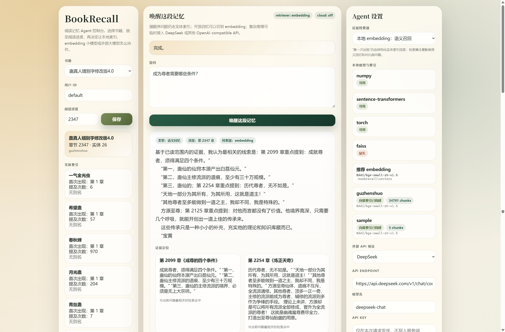

# BookRecall

BookRecall 是一个面向长篇阅读场景的本地阅读记忆 Agent。

它的目标不是“替你读书”，而是帮你在读完很久之后，仍然能快速找回：

- 某个人物第一次出现在哪一章
- 某个道具后来还出现过没有
- 某条线索在你已读范围内是怎么发展的
- 某个主题在前后章节里发生了什么变化

和普通 RAG 不同，BookRecall 不是只靠向量检索。它把结构化实体索引、章节级上下文、细粒度证据片段和一个可控的 ReAct Agent 组合起来，优先解决“第一次出现”“有没有再出现”“不要剧透”这类阅读回忆问题。



## 项目特点

- 本地三层索引：章节解析 -> parent/child chunk -> 结构化实体索引。
- 章节解析支持常见网文目录，包括“第一卷 卷名 / 第一节：小节名”这类分卷结构。
- 强顺序问题可精确回答：例如“第一次出现在哪一章”。
- 三重防剧透：用户阅读进度会限制检索、工具调用和最终证据输出。
- 默认零运行时依赖：核心链路只用 Python 标准库。
- 可选本地 embedding：支持 `sentence-transformers` 本地语义检索。
- 可选外部大模型：支持 OpenAI-compatible API，例如 DeepSeek。
- 内置网页端：可以查看书库、设置阅读进度、切换检索器、配置外部 API、查看本地模型状态。
- 人物关系第一版：基于同章共现和关键词粗分类，支持按阶段回答“谁和谁是什么关系/后来如何变化”。
- 主题线索第一版：支持自动发现/手工指定主题词，并按阶段回答“某个观点前后有什么变化”。
- 事件链第一版：基于实体共现和事件关键词抽取关键事件，支持回答“某个实体涉及哪些关键事件/主线发生了什么”。

## 当前能力

截至当前代码状态，BookRecall 已经具备以下能力：

- CLI 可用：
  - `build`
  - `ask`
  - `set-progress`
  - `show-progress`
  - `list-books`
  - `list-entities`
  - `list-themes`
  - `chapters`
  - `stats`
  - `clear`
  - `serve`
  - `models`
  - `embed-build`
  - `embed-search`
- Agent 可用：
  - 手写 ReAct 状态机
  - 规则策略 `RuleBasedPolicy`
  - 可选云端策略 `LLMReActPolicy`
  - 原生 tool calling 优先，文本协议回退
  - 会话级连续追问记忆
  - 关系查询意图 `relation_lookup`
  - 主题线索意图 `theme_explore`
  - 事件链回忆意图 `event_chain`
  - 可选 `LangGraphPolicy` 图策略（安装 `langgraph` 后可用）
- Web 可用：
  - 书库总览
  - 本地 TXT 文件导入并创建索引
  - 索引规模统计
  - 实体索引浏览
  - 主题线索浏览
  - 事件链浏览
  - 关系索引浏览
  - 章节概览
  - 原文阅读器与证据片段高亮
  - 阅读进度管理
  - 会话级连续追问
  - 本轮工具 trace
  - 快捷提问模板
  - 问答卡片
  - 检索器切换
  - DeepSeek / OpenAI-compatible API 设置
  - 本地 embedding 与向量索引状态查看
  - 当前书向量索引构建
  - 召回层证据检索测试
  - 多本书分组与标签管理
  - 控制台偏好本地持久化
  - 删除书籍数据、删除向量索引、重建结构化索引
  - 长会话历史查看、编辑、删除与重新提问
- 本地 embedding 可用：
  - `sentence-transformers`
  - 推荐模型：`BAAI/bge-small-zh-v1.5`
  - 本地向量索引保存到 `.bookrecall/vectors/`
  - 支持 `numpy / faiss` 双后端，环境无 `faiss` 时自动回退

如果你想看“已经实现了什么、还差什么”，请看 [AGENT_STATUS.md](/D:/BookRecall/AGENT_STATUS.md)。

## 技术架构

```text
User Question
   |
   v
BookRecall Agent
   |- Policy
   |  |- RuleBasedPolicy
   |  |- LLMReActPolicy (optional)
   |  `- LangGraphPolicy (optional)
   |
   |- Tools
   |  |- lookup_first_appearance
   |  |- lookup_timeline
   |  |- lookup_relations
   |  |- search_theme
   |  |- search_events
   |  |- search_evidence
   |  |- lookup_entity_aliases
   |  |- get_chapter_summary
   |  `- list_entities
   |
   |- Retriever
   |  |- LocalRetriever
   |  `- EmbeddingRetriever (optional)
   |
   `- Render
      |- text
      `- json

Local Storage Layer
   |- SQLite
   |- chapters
   |- parent_chunks
   |- child_chunks
   |- entities / aliases / mentions
   |- relations / relation_mentions
   |- themes / theme_aliases / theme_mentions
   |- events / event_entities
   |- reader_state
   `- agent_memory

Optional Cloud Layer
   `- OpenAI-compatible Chat Completions
```

## 依赖说明

### 核心模式

核心模式默认没有第三方运行时依赖。

- Python `>=3.11`
- SQLite 使用 Python 标准库内置模块
- Web 使用 Python 标准库 `http.server`
- 云端 API 调用使用 Python 标准库 `urllib`

也就是说，最基础的 `build / ask / serve` 可以不安装任何额外包。

### 可选依赖

`pyproject.toml` 中目前定义了这些可选依赖组：

- `embedding`
  - `numpy>=1.26.0`
  - `sentence-transformers>=3.0.0`
- `faiss`
  - `faiss-cpu>=1.8.0`
- `graph`
  - `langgraph>=0.2.0`
- `full`
  - `numpy>=1.26.0`
  - `langgraph>=0.2.0`
  - `llama-index>=0.11.0`
  - `faiss-cpu>=1.8.0`
  - `sentence-transformers>=3.0.0`
  - `streamlit>=1.36.0`

注意：

- 当前代码已经实际使用的是 `embedding / faiss / graph` 这几组。
- `full` 里的很多能力还没有全部在代码中接通，它更像未来路线预留。
- `cloud` 依赖组目前为空，因为云端 API 走的是标准库。

## 安装方式

### 方式一：直接运行仓库

```bash
git clone <your-repo-url>
cd BookRecall
python bookrecall.py --help
```

这是最简单的方式，不需要先安装成包。

### 方式二：开发模式安装

```bash
git clone <your-repo-url>
cd BookRecall
python -m venv .venv
source .venv/bin/activate
pip install -e .
```

安装后可以直接使用：

```bash
bookrecall --help
```

### 安装本地 embedding 能力

```bash
pip install -e .[embedding]
```

如果想启用 FAISS 向量后端和 LangGraph Agent 图策略，可以继续安装：

```bash
pip install -e .[faiss,graph]
```

如果你在 Windows + NVIDIA GPU 上使用，也可以手动先装好适配你 CUDA 版本的 `torch`，再安装：

```bash
pip install sentence-transformers
```

## 快速开始

### 1. 用示例书建索引

```bash
python bookrecall.py build \
  --book-id sample \
  --input examples/sample_book.txt \
  --entities examples/sample_entities.txt
```

如果你有主题词表，也可以加：

```bash
python bookrecall.py build \
  --book-id sample \
  --input examples/sample_book.txt \
  --entities examples/sample_entities.txt \
  --themes examples/sample_themes.txt
```

### 2. 设置阅读进度

```bash
python bookrecall.py set-progress \
  --book-id sample \
  --user default \
  --chapter 3
```

### 3. 提问

```bash
python bookrecall.py ask \
  --book-id sample \
  --question "黑袍人第一次出现在哪一章？"
```

也可以询问两个实体的关系和阶段变化：

```bash
python bookrecall.py ask \
  --book-id sample \
  --question "林澈和黑衣人是什么关系？"
```

也可以询问主题线索：

```bash
python bookrecall.py ask \
  --book-id sample \
  --question "自由意志的观点前后有什么变化？"
```

也可以询问事件链：

```bash
python bookrecall.py ask \
  --book-id sample \
  --question "星辰之匙涉及哪些关键事件？"
```

### 4. 输出 JSON 卡片

```bash
python bookrecall.py ask \
  --book-id sample \
  --format json \
  --question "黑袍人第一次出现在哪一章？"
```

### 5. 在同一会话里连续追问

```bash
python bookrecall.py ask \
  --book-id sample \
  --session demo-thread \
  --question "黑袍人第一次出现在哪一章？"

python bookrecall.py ask \
  --book-id sample \
  --session demo-thread \
  --question "后来还有出现过吗？"
```

说明：

- `--session` 是可选参数。
- 只要 `book_id + user + session_id` 一致，Agent 就会复用同一会话最近几轮的上下文。
- 当前第一版主要复用“最近主实体”和简短问答摘要，适合连续追问“后来呢”“那他还有出现吗”这类问题。

## Web 界面

启动本地网页：

```bash
python bookrecall.py serve --host 127.0.0.1 --port 8000
```

浏览器打开：

```text
http://127.0.0.1:8000
```

网页端当前支持：

- 选择本地 TXT 文件并创建本地索引
- 临时粘贴正文试跑
- TXT 文件导入只显示文件摘要和开头短预览，不会把整本书全文写入页面输入框，避免大文件卡顿。
- 填写实体词表和主题词表
- 可选覆盖同名 `book_id` 的已有索引
- 对当前书重建结构化索引
- 删除当前书本地数据
- 为书籍设置分组和标签，并按分组筛选书库
- 选择书籍
- 查看书库统计
- 查看实体索引
- 查看主题线索
- 查看事件链
- 查看关系索引
- 查看章节概览
- 点击章节或证据卡片打开原文，并高亮证据片段
- 设置用户阅读进度
- 输入会话 ID
- 提交问答
- 查看会话历史和本轮工具 trace
- 查看工具调用路径、命中数、防剧透触发次数和每步参数/观察摘要
- 浏览、刷新并切换当前书籍下的会话与分支
- 对比两个会话分支的共同前缀、分歧轮次、独有线索、实体和工具调用
- 编辑、删除历史对话轮次，回放历史工具轨迹，把历史问题放回输入框重新提问，或从某一轮开始重算/新建会话分支
- 使用“首次出现 / 轨迹追踪 / 关系回忆 / 主题变化 / 关键事件”快捷提问模板
- 选择 Agent 执行策略：`auto / rule_based / llm_react / langgraph`
- 选择检索器：`lexical / embedding / auto`
- 查看本地模型依赖状态
- 查看每本书是否已有向量索引
- 为当前书构建本地向量索引
- 删除当前书向量索引
- 直接测试当前召回层，查看 lexical / embedding / auto 命中的证据片段，并打开原文高亮
- 直接配置外部 OpenAI-compatible API
- 快速套用 DeepSeek / OpenAI 预设
- 保存控制台偏好：用户、会话、当前书籍、分组筛选、召回策略、云端开关和模型配置
- 保存当前书籍与用户维度的长期回答偏好：回答风格、关注重点和自定义说明

说明：

- API Key 不会保存在服务端文件中。
- 如果勾选“保存”，API Key 只会保存在当前浏览器的 `localStorage`。
- 控制台偏好使用 `bookrecall.preferences`，旧版 `bookrecall.apiSettings` 会自动兼容读取。
- `langgraph` 是可选依赖；当前本地 `.venv` 已安装时，Web 会显示 `LangGraph ReAct` 可用。未安装时会显示缺依赖，选择它提问会返回明确提示。
- `faiss` 是可选向量后端；当前本地 `.venv` 已安装时，Web 会显示 `faiss` 可用，并可构建 FAISS 索引。未安装时选择 Auto/Numpy 仍可构建和检索向量索引。
- 网页端“导入书籍并建索引”不会自动下载 embedding 模型；它只构建 SQLite 本地结构化索引。
- 如果要使用本地 embedding 检索，可以在网页端点击“构建当前书向量索引”，也可以继续用 CLI 的 `embed-build`。
- 构建向量索引会加载本地 embedding 模型；如果本地缓存不存在，`sentence-transformers` 可能联网下载模型。

### Web 前端结构

当前 Web 端已经从 `web.py` 内部的大字符串拆分为静态资源：

- `src/bookrecall/web_assets/index.html`
- `src/bookrecall/web_assets/app.css`
- `src/bookrecall/web_assets/app.js`

服务端仍然使用 Python 标准库 `http.server` 提供页面、静态资源和 JSON API，所以不需要 Node.js、Vite 或 npm 构建步骤。

暂时没有引入前端框架，原因是：

- 当前项目的核心优势是本地零依赖启动，直接 `python bookrecall.py serve` 就能运行。
- 现有交互还可以由原生 HTML/CSS/JS 稳定承担。
- 如果后续出现多页面路由、复杂组件复用、拖拽式图谱或大型状态管理，再迁移到 Vite + React/Svelte 会更合适。

### Web API 快速参考

常用接口：

- `GET /api/books`
- `POST /api/books/build`
- `POST /api/books/{book_id}/rebuild`
- `POST /api/books/{book_id}/delete`
- `POST /api/books/{book_id}/metadata`
- `GET /api/books/{book_id}/stats`
- `GET /api/books/{book_id}/entities`
- `GET /api/books/{book_id}/themes`
- `GET /api/books/{book_id}/events`
- `GET /api/books/{book_id}/relations`
- `GET /api/books/{book_id}/chapters/{chapter_number}`
- `GET /api/books/{book_id}/preferences`
- `POST /api/books/{book_id}/preferences`
- `POST /api/books/{book_id}/vectors`
- `POST /api/books/{book_id}/vectors/delete`
- `POST /api/books/{book_id}/search`
- `GET /api/books/{book_id}/sessions`
- `GET /api/books/{book_id}/sessions/compare`
- `POST /api/books/{book_id}/session/turns/{turn_id}`
- `POST /api/ask`
- `POST /api/progress`

`POST /api/books/build` 请求体示例：

```json
{
  "book_id": "sample",
  "title": "示例书",
  "text": "第1章 起点\n\n正文...",
  "entities": "黑衣人|黑袍人\n星辰之匙|钥匙",
  "themes": "自由意志|选择",
  "overwrite": false
}
```

`POST /api/books/{book_id}/vectors` 请求体示例：

```json
{
  "model": "BAAI/bge-small-zh-v1.5",
  "backend": "auto",
  "limit_chunks": null
}
```

`POST /api/books/{book_id}/metadata` 请求体示例：

```json
{
  "book_group": "小说",
  "tags": ["二刷", "重点", "长篇"]
}
```

## 本地 embedding 用法

### 查看模型状态

```bash
python bookrecall.py models
```

### 构建向量索引

```bash
python bookrecall.py embed-build \
  --book-id sample \
  --model BAAI/bge-small-zh-v1.5
```

说明：

- 如果当前环境可用 `faiss`，索引会优先构建为 `faiss` 后端。
- 如果没有 `faiss`，会自动回退为 `numpy` 后端，不影响使用。
- `python bookrecall.py models` 和 `embed-build` 输出里会显示实际使用的 backend。

可选参数：

- `--batch-size`
- `--vector-dir`
- `--limit-chunks`

### 直接做 embedding 检索

```bash
python bookrecall.py embed-search \
  --book-id sample \
  --query "黑袍人后来还出现过吗？" \
  --progress 3
```

### 在问答里启用 embedding 检索

```bash
python bookrecall.py ask \
  --book-id sample \
  --retriever embedding \
  --question "这本书前面关于自由意志的观点是什么？"
```

也可以用自动模式：

```bash
python bookrecall.py ask \
  --book-id sample \
  --retriever auto \
  --question "这本书前面关于自由意志的观点是什么？"
```

自动模式的行为是：

- 如果该书已有向量索引且本地依赖可用，则使用 embedding 检索。
- 否则自动回退到倒排检索。

## 外部 API 用法

BookRecall 支持 OpenAI-compatible Chat Completions 接口。

默认读取这些环境变量：

```bash
BOOKRECALL_API_KEY
BOOKRECALL_API_ENDPOINT
BOOKRECALL_MODEL
```

例如：

```bash
export BOOKRECALL_API_KEY="sk-xxx"
export BOOKRECALL_API_ENDPOINT="https://api.deepseek.com/v1/chat/completions"
export BOOKRECALL_MODEL="deepseek-chat"
```

或者在网页端直接填写：

- Endpoint
- Model
- API Key
- 启用外部大模型 ReAct 规划

当前云端模型主要用于：

- 复杂问题的多步规划
- 对多个证据片段做综合
- 给出更自然的最终总结

它不会替代本地索引层，也不会绕过防剧透限制。

## CLI 命令总览

### 索引与书库

- `build`
  - 为一本书建立 SQLite 索引
- `list-books`
  - 查看当前书库
- `stats`
  - 查看索引规模
- `chapters`
  - 查看章节标题
- `clear`
  - 删除某本书的索引，需要 `--yes`

### 阅读状态

- `set-progress`
  - 保存阅读进度
- `show-progress`
  - 查看阅读进度

### 问答与检索

- `ask`
  - 提问并输出记忆卡片
- `list-entities`
  - 查看实体索引
- `list-themes`
  - 查看主题线索索引
- `models`
  - 查看本地模型状态
- `embed-build`
  - 构建向量索引
- `embed-search`
  - 直接做向量检索

### Web

- `serve`
  - 启动本地 Web 控制台

## 实体词表格式

支持手工实体词表，每行一个实体。

格式：

```text
标准名|别名1,别名2
```

例如：

```text
星辰之匙|钥匙,星匙
黑衣人|黑袍人,黑衣客
自由意志
```

如果不传 `--entities`，系统会尝试自动发现实体。

## 主题词表格式

主题词表格式与实体词表一致：

```text
自由意志|自主选择,自由选择
命运
权力
```

如果不传 `--themes`，系统会用内置常见主题词做轻量自动发现，例如“自由意志、命运、选择、权力、信仰、人性”等。

## 输出结构

BookRecall 的核心输出是一个结构化记忆卡片，包含：

- `question`
- `intent`
- `answer`
- `progress_chapter`
- `spoiler_blocked`
- `entity_name`
- `summary`
- `evidence`
- `suggestions`

这使它既适合 CLI，也适合 Web 或未来接前端应用。

## 测试

运行全部测试：

```bash
python -m unittest discover -s tests -v
```

当前测试覆盖：

- 章节解析
- 倒排检索
- embedding 索引构建与检索
- Agent 核心问答
- Agent 工具层
- 人物关系索引、阶段摘要与 `lookup_relations`
- 主题线索索引、阶段摘要与 `search_theme`
- LLM ReAct 文本解析
- Web API

当前代码状态下测试数量为：

```text
83 tests
```

## 项目结构

```text
bookrecall.py
src/bookrecall/
  agent/
    core.py
    state.py
    tools.py
    render.py
    policies/
  parser.py
  chunking.py
  entity_index.py
  retrieval.py
  embeddings.py
  storage.py
  cloud.py
  web.py
  cli.py
tests/
examples/
```

## 适用场景

适合：

- 长篇小说回忆
- 网文追更回顾
- 学术著作章节线索定位
- 需要强顺序和防剧透控制的阅读助手

不适合：

- 直接替代通用聊天机器人
- 不建索引就即时读整本大书
- 需要完整知识图谱和复杂编辑工作流的场景

## 当前限制

这个项目已经能用，但还不是最终形态。

当前仍然存在这些限制：

- LangGraph 已作为可选策略接入，但还不是完整 checkpoint / 中断恢复 / human-in-the-loop 图工作流
- 虽然已经接入原生 tool calling 优先链路，但还没有做更完整的多供应商兼容验证
- 人物关系第一版已接入，能做阶段摘要，但还不是事件级高质量关系图谱
- 主题线索第一版已接入，能做阶段摘要，但还不是完整深层主题演化分析
- 跨会话 Agent 记忆和用户长期偏好已有第一版，但会话摘要压缩还没完成
- FAISS 是可选后端，真实大规模性能还没有系统压测
- Web 仍然是单页零依赖控制台，不是完整产品前端

更详细的现状和路线见 [AGENT_STATUS.md](/D:/BookRecall/AGENT_STATUS.md)。

## License

Apache-2.0
